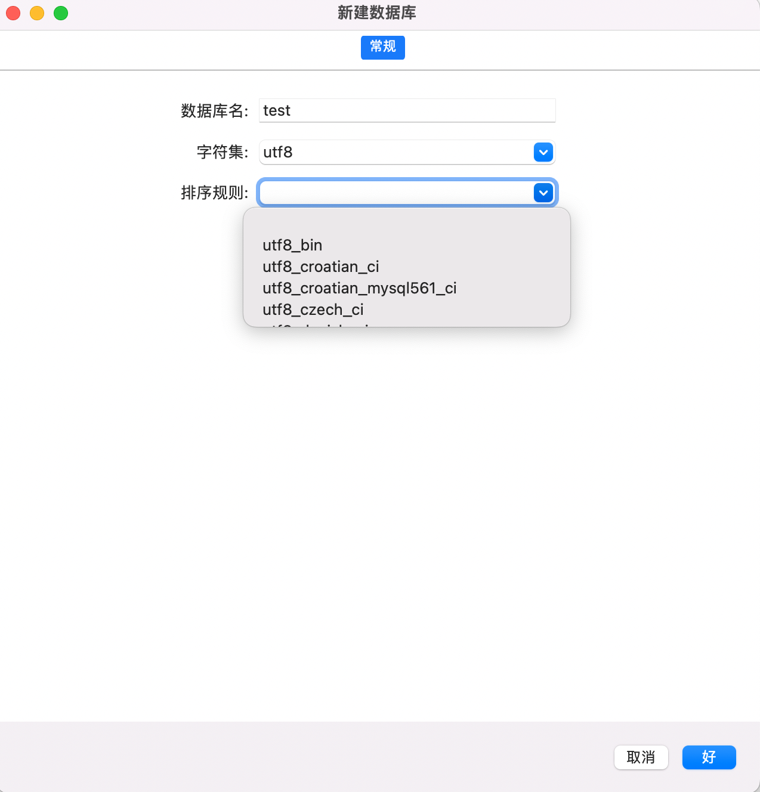
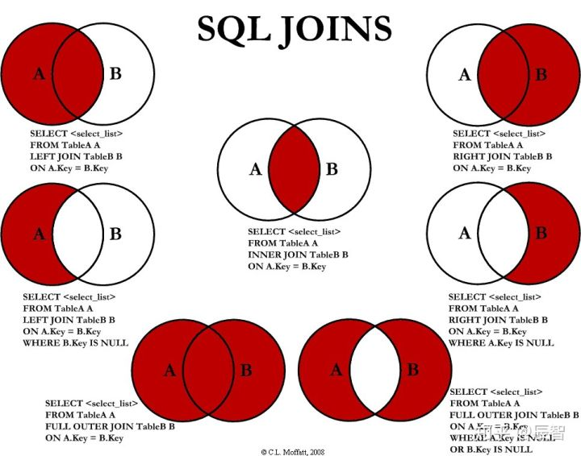
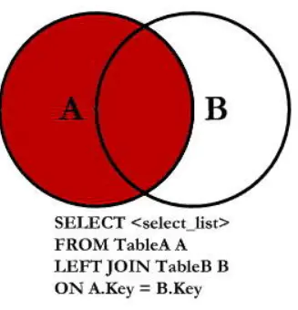
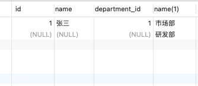
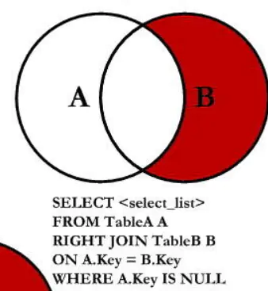
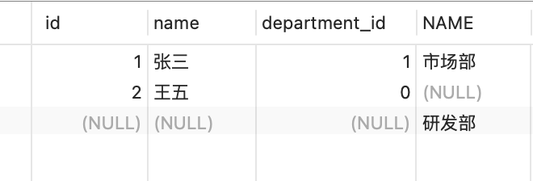

# MySQL入门


# MySQL快速起步


## 安装

基于Docker安装:
```sh
$ docker run -p 3306:3306 -itd -e MARIADB_USER=cmdb -e MARIADB_PASSWORD=123456 -e MARIADB_ROOT_PASSWORD=123456 --name mysql   mariadb:latest
```

## DDL(数据定义语句)

Database Define Language缩写, 也就是用于创建数据库和表的SQL语法

### 定义库



#### 数据库名

数据库整体命名规则采用snak缩写规则, 比如 cmdb_service ,注意禁止使用中横线 比如cmdb-service

其他情况按照报错提醒 去掉不合法字符就可以

#### 字符集

字符集字面理解就是 一堆字符的合集, 每个字符集包含的字符个数不同, 比如:
+ 英文字符集: ASCII, 采用7位编码, 总共能编码2^7个字符
+ 中文字符集(兼容ASCII): GB2312、BIG5、GBK, GB18030, 都采用双字节字进行编码,
+ 万国码(兼容ASCII): Unicode, 变长编码, 常见的编码在前面, 不常见的往后面编码

比较值得注意的是 
+ utf8: 并不是完整的utf8实现, 采用3字节保存, 超过3字节的编码无法识别, 比如 emoji字符 😵‍💫, [更多Emoji字符](https://getemoji.com/)
+ utf8mb4: MySQL后面意识到了这个问题, 支持4个字节, 大部分常用的基本就包含了

也就1个字节的空间节省, 具体使用看自己需求

#### 排序规则

排序规则: 是指对指定字符集下不同字符的比较规则

MySQL中常用的排序规则(这里以utf8字符集为例)主要有：
+ utf8_general_ci
+ utf8_general_cs
+ utf8_unicode_ci
+ ...


1. 大小写区分

这里需要注意下ci和cs的区别:
+ ci(Case Insensitive), 即“大小写不敏感”，a和A会在字符判断中会被当做一样的;
+ cs(Case Sensitive)，即“大小写敏感”，a 和 A 会有区分；

比如:
```sql
-- 比如数据库存在 user: Alice
select * from t_user where usre = 'alice' 
-- 如果数据库使用的是utf8_general_ci排序规则, 下面的查询是可以查询到这条数据
-- 如果数据库使用的是utf8_general_cs排序规则, 下面的查询是查询不到这条数据
```

比如utf8_general_ci下:
```
mariadb> SELECT * FROM t_user WHERE name = 'alice';
+----+-------+---------------+
| id | name  | department_id |
+----+-------+---------------+
|  3 | Alice |             0 |
+----+-------+---------------+
```

由于比对模糊, 速度上往往ci比cs快

2. 校对准确性

+ general: 校对规则仅部分支持Unicode校对规则算法(遗留的校对规则), 主流的都支持, 比如中、英文, 但是比较偏门的一些语言不支持比如越南和俄罗斯, 因为不是不包含全部字符的校验规则, 所以校对速度快，但准确度稍差
+ unicode: 支持所有unicode字符校对, 准确度高，但校对速度稍慢

```sql
-- utf8_general_ci下面的等式成立
ß = s
-- 对于utf8_unicode_ci下面等式成立
ß = ss
```

比如utf8_general_ci下:
```
mariadb> SELECT * FROM t_user WHERE name = 'sob';
+----+------+---------------+
| id | name | department_id |
+----+------+---------------+
|  4 | ßob |             1 |
+----+------+---------------+
```

总结:
+ utf8_unicode_ci: 德语、法语或者俄语
+ utf8_general_ci: 主流语言, 比如中、英文

下面3个也是相等的, 同样可以自己尝试, 有些黑客会用此来伪装密码
```
Ä = A
Ö = O
Ü = U
```

### 定义表


#### 表结构(字段)


#### 索引


#### 完整性约束


## DML(数据操作语句)

### INSERT

语法格式:
```sql
INSERT INTO table_name (column1,column2,column3,...)
VALUES (value1,value2,value3,...);
```

如果列的顺序和你表的顺序一致可以省略列:
```sql
INSERT INTO table_name
VALUES (value1,value2,value3,...);
```

为了提升插入的性能，也可以一次插入多条数据
```sql
INSERT INTO table_name
VALUES (value1,value2,value3,...),
       (value1,value2,value3,...),
	   (value1,value2,value3,...);
```


### SELECT

语法格式:
```sql
SELECT column_name,column_name
FROM table_name;
```

1. SELECT Column 实例
```
SELECT id,`name` FROM t_user;
+----+--------+
| id | name   |
+----+--------+
|  1 | 张三 |
|  2 | 王五 |
+----+--------+
```


2. SELECT * 实例
```
mariadb> SELECT * FROM t_user;
+----+--------+---------------+
| id | name   | department_id |
+----+--------+---------------+
|  1 | 张三 |             1 |
|  2 | 王五 |             0 |
+----+--------+---------------+
```

### UPDATE

语法格式:
```sql
UPDATE table_name
SET column1=value1,column2=value2,...
WHERE some_column=some_value;
```


### DELETE

语法格式
```sql
DELETE FROM table_name
WHERE some_column=some_value;
```

### REPLATE

我们经常会遇到这样的场景: 如果不重复则插入新数据, 如果有重复记录则替换, 

使用REPLACE的最大好处就是可以将DELETE和INSERT合二为一，形成一个原子操作。这样就可以不必考虑在同时使用DELETE和INSERT时添加事务等复杂操作了

REPLACE的语法和INSERT非常的相似:
```sql
REPLACE INTO table_name (column1,column2,column3,...)
VALUES (value1,value2,value3,...);
```

## 联表查询



在进行关联查询之前 我们需要至少准备2张表（现实中的项目往往比较复杂, 5，6张表联合查询是常事儿）

我们以用户系统为例:

+ 用户表: t_user


```
mysql> select * from t_user;
+----+--------+---------------+
| id | name   | department_id |
+----+--------+---------------+
|  1 | 张三 |             1 |
|  2 | 王五 |             0 |
+----+--------+---------------+
```


+ 部门表: t_department


```
mysql> select * from t_department;
+----+-----------+
| id | name      |
+----+-----------+
|  1 | 市场部 |
|  3 | 研发部 |
+----+-----------+
```


### LEFT JOIN



以左表为准, 把符合条件的关联过来, 如果没有则使用null

比如查询用户的同时，查询出用户所属的部门
```sql
SELECT
	u.*,
	d.name 
FROM
	t_user u
	LEFT JOIN t_department d ON u.department_id = d.id

-- ON 也可以添加多个条件
```


注意:
+ department 1 右表有数据
+ department 0 右表无数据
+ department 3 左表无数据

### RIGHT JOIN


以右表为准, 把符合条件的关联过来, 如果没有则使用null

```sql
SELECT
	u.*,
	d.name 
FROM
	t_user u
	RIGHT JOIN t_department d ON u.department_id = d.id
```



注意:
+ 张三 部门1        左边表有数据
+ 王五 部门0        不符合关联条件 无数据
+ 市场部            右表有, 左表无数据

### INNER JOIN


意思就是取交集，就是要两边都有的东西，所以也就是不能有null出现

```sql
SELECT
	u.*,
	d.name 
FROM
	t_user u
	INNER JOIN t_department d ON u.department_id = d.id
```


### Left Join且不含B


A中与B没有交集的部分，所以就是，join B表会得到null的内容, 比如获取哪些用户没有部门

```sql
SELECT
	u.*,
	d.name 
FROM
	t_user u
	LEFT JOIN t_department d ON u.department_id = d.id WHERE d.name is NULL
```


### Right Join且不含A



同理，就是与上面的情况相反, 不如我们需要筛选出那么部门没有人

```sql
SELECT
	u.*,
	d.name 
FROM
	t_user u
	RIGHT JOIN t_department d ON u.department_id = d.id WHERE u.id IS NULL
```


### Full Join


mysql语法不支持full outer join, 也就是说我们无法通过一个语句来实现集合的求和操作, 所以我们用union来实现, UNION 操作符用于合并两个或多个 SELECT 语句的结果集

union 是对数据进行并集操作, 因此需要要求数据: 
+ 合并集合的结果有相同个数的列
+ 并且每个列的类型是一样的

1. Union: 合并集合, 并且数据去重
```sql
SELECT
	u.*,
	d.NAME 
FROM
	t_user u
	LEFT JOIN t_department d ON u.department_id = d.id 
UNION
SELECT
	u.*,
	d.NAME 
FROM
	t_user u
	RIGHT JOIN t_department d ON u.department_id = d.id
```



2. Union ALL: 合并集合, 不去重
```sql
SELECT
	u.*,
	d.NAME 
FROM
	t_user u
	LEFT JOIN t_department d ON u.department_id = d.id 
UNION ALL
SELECT
	u.*,
	d.NAME 
FROM
	t_user u
	RIGHT JOIN t_department d ON u.department_id = d.id
```


因为Union ALL 少了去重的操作, 性能上会把Union好很多, 特别是当集合特别大的时候

3. union all 自己计算

比如我们把红色部分拆分为2部分:
+ A和B的左连接(A + AB公共的)
+ A和B的右连接去除公共部分(B独有的部分)

```sql
SELECT
	u.*,
	d.NAME 
FROM
	t_user u
	LEFT JOIN t_department d ON u.department_id = d.id 
UNION ALL
SELECT
	u.*,
	d.NAME 
FROM
	t_user u
	RIGHT JOIN t_department d ON u.department_id = d.id WHERE u.id IS NULL
```


### Full Join且不含交集


还是用union来实现full outer join

```sql
SELECT
	u.*,
	d.NAME 
FROM
	t_user u
	LEFT JOIN t_department d ON u.department_id = d.id WHERE d.id IS NULL 
UNION ALL
SELECT
	u.*,
	d.NAME 
FROM
	t_user u
	RIGHT JOIN t_department d ON u.department_id = d.id WHERE u.id IS NULL
```


## 子查询


## 常用函数


### 字符函数

+ substr
+ length
+ contact


### 日期函数

+ NOW()
+ UNIX_TIMESTAMP


## 常用语句


### DISTINCT


### ON DUMPLICATE KEY


### SELECT INTO


### GROUP_CONTAT


### IF与IFNULL


### CASE语句


### DELETE 联表


## 参考

+ [MySQL字符集和排序规则](https://segmentfault.com/a/1190000020339810)
+ [MySQL 中的三中循环 while loop repeat 的基本用法](https://www.cnblogs.com/Luouy/p/7301360.html)
+ [MySQL里面的子查询的基本使用](http://www.codebaoku.com/it-mysql/it-mysql-218378.html)
+ [MySQL 子查询优化](https://www.jianshu.com/p/3989222f7084)
+ [MySQL—基于规则优化 子查询优化](https://www.rsthe.com/archives/mysql%E5%9F%BA%E4%BA%8E%E8%A7%84%E5%88%99%E4%BC%98%E5%8C%96%E5%AD%90%E6%9F%A5%E8%AF%A2%E4%BC%98%E5%8C%96)